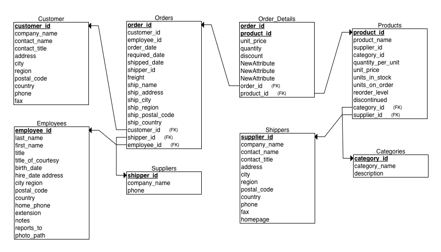

# Basic Level SQL Questions
The questions in this section helps you have a basic understanding of the database and tables. It prepares you with the skills of querying the database at the basic level. The CRM datasets are very likely to be the ones you will encounter in business, such as retailing. Being able to ask relevant questions is critical for business analyst or data scientist. These questions are designed along that.

## Key knowledge to be learned
+ Retrieving data
+ Sorting and filtering data
+ Calculated fields and functions
+ Summarizing and grouping data


### Q1: Understand the basic information of each table of the CRM database. Select Top 10 records from each table. It is a good way to visualize all the fields and have a basic understanding of the relationship between the database tables. 

```sql
SELECT * FROM table_name LIMIT 10;

```

### Q2: From the “shippers” table, select shippers with a phone number starting with “1-800” or ending with “9931” or shipper_id equal to 1.

```sql
SELECT *
FROM shippers
WHERE phone LIKE '1-800%' OR phone LIKE '%9931' OR shipper_id = 1;

```

### Q3: For the “customers” table, do three things: 
+ select the total number of records; 
+ determine if there is any duplicate in the customer record; 
+ We want to know the number of customers for each country. Please output distinct customer count group by country and sort the results from the highest to the lowest.

```sql
SELECT COUNT(*) FROM customers;

SELECT customer_id, COUNT(*)
FROM customers
GROUP BY customer_id
HAVING COUNT(*) > 1;

SELECT country, COUNT(DISTINCT customer_id) AS customer_count
FROM customers
GROUP BY country
ORDER BY customer_count DESC;

```

### Q4: From the “employees” table, select first name, last name, and title of all employees with “country” as “USA” and with “title” as “Vice President, Sales”. 

```sql
SELECT first_name, last_name, title
FROM employees
WHERE country = 'USA' AND title = 'Vice President, Sales';

```

### Q5: For the “orders” table, do three things: 
+ count the number of orders that have “ship_region” as NULL; 
+ select all the orders that have “order_date” from 1996-07-10 to 1996-07-30, including the lower and upper bound, and “ship_country” as “France” or “Germany”;
+ We want to find out orders that took too long to fulfill. First, filter out orders that have “shipped_date” as NULL, and second, select the order_id, order_date, shipped_date, and the time elapsed between order_date and shipped_date (name it “gap”) of orders that have gap large than 30 days. Sort the results by gap in descending order.

```sql
SELECT COUNT(*)
FROM orders
WHERE ship_region IS NULL;

SELECT *
FROM orders
WHERE (order_date BETWEEN '1996-07-10' AND '1996-07-30')
  AND ship_country IN ('France', 'Germany');

SELECT order_id, order_date, shipped_date, 
       EXTRACT(DAY FROM (shipped_date - order_date)) AS gap
FROM orders
WHERE shipped_date IS NOT NULL
  AND EXTRACT(DAY FROM (shipped_date - order_date)) > 30
ORDER BY gap DESC;

```

### Q6:   From the “order_details” table, 
+ Select the top 5 orders ranked by sub_total (unit_price x quantity) in descending order (output fields: order_id, sub_total). Please round the sub_total to two decimal places.
+ Select the order_id, sub_total of those orders that have more than 5 distinct products, sort by sub_total in descending order. Please round the sub_total to the nearest integer.

```sql
SELECT order_id, 
       ROUND(SUM(unit_price * quantity), 2) AS sub_total
FROM order_details
GROUP BY order_id
ORDER BY sub_total DESC
LIMIT 5;

```

### Q7:   From the “suppliers” table, select contact_name, contact_title for those suppliers whose “contact_title” is NOT “Marketing Manager”, “Sales Manager”, and “Owner”. Sort the result by contact_name in ascending order and only output the top 5 record.

```sql
SELECT contact_name, contact_title
FROM suppliers
WHERE contact_title <> "Marketing Manager, Sales Manager, Owner”
ORDER BY ASD
LIMIT 5;
```

### Q8: Without using JOIN statements, from the “suppliers” table, select company_name, city, country of those suppliers which sell products that have unit_price large than 100.

```sql
SELECT company_name, city, county
FROM suppliers,
WHERE sup
```

### Q9: From the “order_details” table, for each product_id, count the number of distinct orders and calculate the average unit_price (round to 2 decimal place). Output those with an average unit_price less than $7. Sort the result in ascending order by avg_unit_price.

```sql
Input your solution here
```

### Q10: Now that you have explored some of the tables of the CRM database, can you draw a Relational Schemas diagram to show the relationships between tables in the CRM database. You can refer to the diagram in the SQL Challenge as an example. Here is a website that’s quite useful: https://erdplus.com/

Tables of the CRM database: Customers, Orders, Order Details, Products, Categories, Shippers, Employees, and Suppliers.


